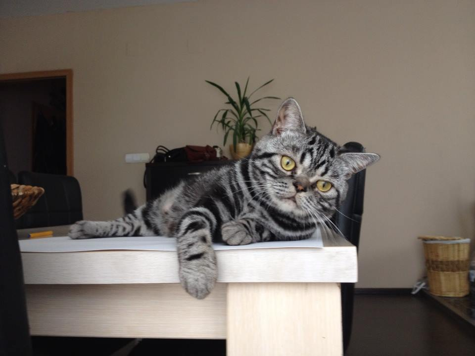

# Team-Kai
## KAI FIGHTER GAME
###Telerik Academy 2016 OOP Teamwork  

A horrible virus has infected the minds of the trainers team of Telerik Academy. Now, at this very dark day of Apocalypse, their madness has reach the point of no return ([the event horizon :D](https://en.wikipedia.org/wiki/Event_horizon)) They've infected all of the Progress computers with a devilish plague of malicious binaries which turned all computers into greedy bitcoin miners. The evil trainers have infested most of the system and are rapidly multiplying! The only way to heal the system is from within, and here comes our only hope, the _ONE_ who can walk through fire and space, and time - NNNNee..., pardon, _teh_ bravest cat around - _Kai, the KaiFighter_! He can't wait to get his hands (eehm... paws) dirty, crush flesh and bone (read RAM & ROM) ([and occasionally... drink tequilla shots](http://www.wikihow.com/Drink-a-Tequila-Shot)). We have a single problem, the KaiFighter is blind! So... you have to help him, yes, YOU! You have to guide the KaiFighter (and direct his powerful, monstrous paws) in this adventure of preventing complete and irreversible system failure!  

**This masterpiece has been brought to you piece by piece by:**
* [**Alexander Yankov** aka **snowflake2513**](http://telerikacademy.com/Users/snowflake2513)
* [**Alexander Mironov** aka **Mironov**](http://telerikacademy.com/Users/Mironov)
* [**Ana Beleva** aka **anabeleva10**](http://telerikacademy.com/Users/anabeleva10)
* [**Boiko Bonev** aka **BoykoBonev**](http://telerikacademy.com/Users/BoykoBonev)
* [**Martin Stoyanov** aka **martinst1**](http://telerikacademy.com/Users/martinst1)
* [**Rosen Georgiev** aka **Rosen_Georgiev**](http://telerikacademy.com/Users/Rosen_Georgiev)
* [**Stoyan Stoyanov** aka **thewayofthesamurai**](http://telerikacademy.com/Users/thewayofthesamurai)

Sorry for the long post, here is a KaiFighter cat to brighten up your day!  

For more juicy stuff: [SOURCE CODE](https://github.com/StoyanStoyanov/Team-Kai/tree/master/KaiFighter/KaiFighterGame)  

We had lots of fun while developing this simple game!  
We hope you enjoy trying it out, too!
